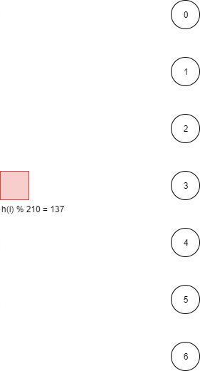

Sharded DB
==========

This repository contains a sample implementation of a sharded key-value store designed for high-availability using shuffle sharding.

## Design

### Shard discovery

<p align="center">
  
</p>

When a router node receives a request for a piece of information, it has to determine which data nodes should contain it. In this case, the router node knows that there are a fixed number of data nodes in total (`N`) and that a fixed number of them (`k`) should contain that piece of information.

There are two potential approaches to decide which nodes should contain the information: using combination or permutation. Both first requires to calculate a hash value (`h()`) out of a unique identifier, or key (`i`).

Here, we use the permutation approach, as it gives a preferential order for each identifier, which makes it easier to distribute load across nodes evenly without relying on round-robin mechanism. With a large enough number of items, all nodes should receive a similar amount of traffic using only the first node in the list of nodes for a specific identifier.

To calculate the list of data nodes for an identifier, we perform a modulo with the number of permutations (`i mod (n!/(n-k)!)`). For each node in order, we recursively perform modulo and integer division. After the first iteration, we might need to adjust the data node index. For example, if the first node is `1`, and the second operation gives `1` as well, the second node would actually be `2` as node `1` is already used.

```go
func SortedInsert(sortedNodes []int, node int) ([]int, int) {
    for i, sortedNode := range sortedNodes {
        if node >= sortedNode {
            node++
        } else {
            return append(sortedNodes[:i], append([]int{node}, sortedNodes[i:]...)...), node
        }
    }
    return append(sortedNodes, node), node
}

func GetNodes(identifier, numNodes, numReplicas int) []int {
    var nodes, sNodes []int
    value := identifier
    for modulo := numNodes; modulo > numNodes-numReplicas; modulo-- {
        node := value % modulo
        sNodes, node = SortedInsert(sNodes, node)

        nodes = append(nodes, node)
        value /= modulo
    }

    return nodes
}
```

However, if we only want to retrieve the first node, we only need to get the identifier modulo the number of data nodes, which is much faster. By using permutation instead of combination, we can limit ourselves to only use the first node, as traffic across node should even out over a large number of unique identifiers.

```go
func GetNode(identifier, numNodes int) int {
    return identifier % numNodes
}
```

The other nodes would then only be used if the first node is not available. As the second data nodes for any piece of information share the same property of being evenly distributed as the first one, we can use the first available node in the list.

```go
func GetNodeN(identifier, numNodes, pos int) int {
    var node int
    var sNodes []int
    value := identifier
    for modulo := numNodes; modulo >= numNodes-pos; modulo-- {
        node = value % modulo
        sNodes, node = SortedInsert(sNodes, node)
        value /= modulo
    }
    return node
}
```